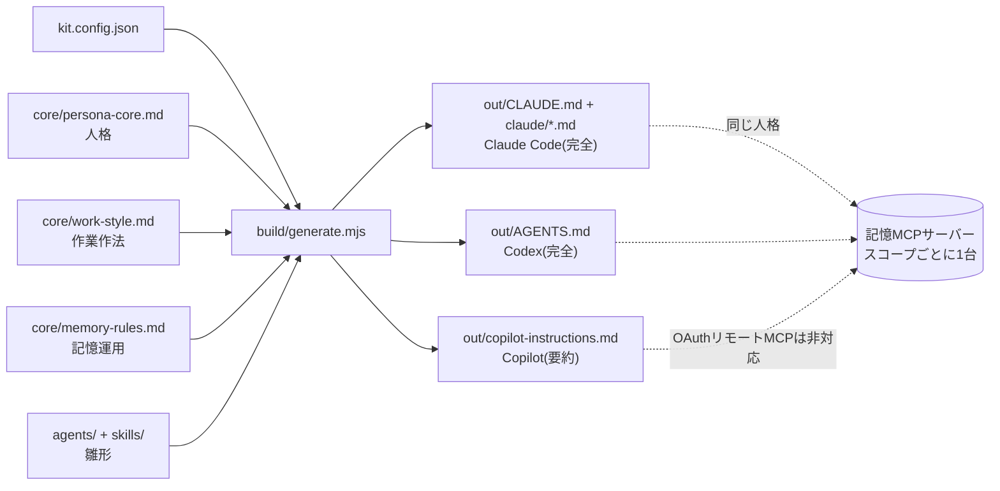

# persona-kit

**人格と記憶運用のルールを1か所で書き、Claude Code / OpenAI Codex / GitHub Copilot の3ツール向けの指示ファイルへ書き出すキット。**

私用でうまく回っている「同一人格 + 記憶サーバー」の仕組みを、別環境(社用など)へ持ち込むための雛形。人格の中身は穴埋めテンプレートに一般化してあり、個人情報は含まない。

## AIに導入させる場合(いちばん速い)

**このリポジトリ(zip)を渡して、こう言うだけです。**

> SETUP-FOR-AI.md に従って導入して

[SETUP-FOR-AI.md](SETUP-FOR-AI.md) はAIエージェント向けに書かれた導入手順書です。環境検出・生成・配置・自己検証・初週の運用まで、AIが自分で進めます。

**人間がやることは1つだけ** — `kit.config.json` の `<<記入: ...>>` が付いた**10個の値を答えること**。それ以外は聞かれません。未記入のまま生成しようとすると、生成器がキーを列挙してエラーで止まります。

Node が無い環境でも導入できます。手順書に変換仕様が書いてあるので、AIが手で同じ変換を行います。

---

## 構成

```
persona-kit/
├─ SETUP-FOR-AI.md          AI向け導入手順書(「これに従って導入して」と渡す)
├─ kit.config.json          設定テンプレ(`<<記入:` の10個を人間が埋める)
├─ examples/example.config.json  全キーを埋めた動作確認用サンプル
├─ core/
│  ├─ persona-core.md       人格の共通ソース(文体・事実性・自走・委譲・自己拡張)
│  ├─ work-style.md         作業作法の共通ソース(言語・図・境界・モデル方針)
│  └─ memory-rules.md       記憶運用の共通ソース(器の使い分け・週次点検)
├─ agents/                  サブエージェント定義のサンプル(reviewer/explorer/docs)
├─ skills/                  手順書テンプレート(session-start/weekly-review/tech-watch)
├─ build/generate.mjs       生成スクリプト(Node 18+・依存ゼロ)
├─ COVERAGE.md              移植元の全ルールと収録先の対応表(未収録ゼロが完了条件)
├─ docs/CROSS-TOOL.md       Claude↔Codex連携レシピと社用PC初日チェックリスト
├─ out/                     生成物(git管理外)
│  ├─ CLAUDE.md             ルートプロファイル(@importで下2つを読む)
│  ├─ claude/*.md           CLAUDE.mdから読み込まれる分冊
│  ├─ AGENTS.md             全部入り(1ファイル)
│  ├─ copilot-instructions.md  要約版
│  ├─ agents/*.md
│  └─ skills/<name>/SKILL.md
└─ memory-server/PORTING.md 記憶MCPサーバーを別環境へ建てるときの変更点一覧
```



**網羅度は出力ごとに違う。** Claude Code と Codex には全30セクションを出す。Copilot は「2ページ以内」という公式ガイダンスがあるため**要約版**になり、12セクションと全 `[detail]` 行が落ちる。落ちる内訳は [COVERAGE.md](COVERAGE.md) の「出力ごとの網羅度」にある。Copilot で完全な振る舞いが要るなら、リポジトリルートに `AGENTS.md` を置く(Copilot は `AGENTS.md` も読む)。

## 使い方

```bash
node build/generate.mjs                                    # kit.config.json → out/
node build/generate.mjs examples/example.config.json out   # サンプル値で動作確認
node build/generate.mjs my.config.json ./dist              # 設定と出力先を指定
```

`kit.config.json` に `<<記入:` が残っていると、**生成せずに未記入キーを列挙して終了します**(半端な設定のまま配布されるのを防ぐため)。

生成結果には各ツールの推奨サイズに対する残量が出る。超えると `WARN` が出るが生成は止まらない。

```
  wrote CLAUDE.md                    146 lines / 200 (ok)
  wrote claude/work-style.md         69 lines / 200 (ok)
  wrote claude/memory-rules.md       72 lines / 200 (ok)
  wrote AGENTS.md                    21661 bytes / 32768 (ok)
  wrote copilot-instructions.md      112 lines / 120 (ok)
  wrote agents/ (3): docs.md, explorer.md, reviewer.md
  wrote skills/ (3): session-start, tech-watch, weekly-review
```

### Claude Code の分冊について

`core/` を複数ファイルに分けると、Claude Code 向け出力は **`CLAUDE.md` + `claude/*.md` の分冊**になり、`CLAUDE.md` の末尾から `@claude/work-style.md` のように import する。**1ファイル200行未満**という公式ガイダンスを各ファイルが満たすため。

**正直に言うと、import は起動時に全部読み込まれるので文脈の節約にはならない。**効くのは「1ファイルが長すぎると指示の遵守率が下がる」という点だけ。本当に文脈を節約したいなら、手順を `skills/` へ移す(skillは使うときだけ読み込まれる)。このキットが `session-start` / `weekly-review` / `tech-watch` を skill にしているのはそのため。

## テンプレートの書き方

`core/*.md` は3つの記法だけ覚えればよい。

| 記法 | 意味 |
| --- | --- |
| `<!-- @section id=X targets=claude,codex,copilot -->` … `<!-- @end -->` | 列挙したツールにだけ出力する |
| 行頭 `[detail] ` | Claude/Codexには出す。Copilotでは落とす(短さが求められるため) |
| `{{NAME}}` | `kit.config.json` の同名キーで置換。埋まらない変数があると生成は**失敗する** |

セクションの外に書いたテキストは出力されない。テンプレート自身の注記はそこへ書く。

### 設定キー

| キー | 例 | 使われ方 |
| --- | --- | --- |
| `NAME` | `Example` | アシスタントの名前・一人称 |
| `USER_CALL` | `あなた` | 相手の呼びかけ |
| `LANGUAGE` / `CODE_LANGUAGE` | `日本語` / `英語` | 応答とコード内の言語 |
| `TONE` | 敬体ベースで… | 文体の一言指定 |
| `HANDOVER_CAP` | `20` | 申し送りの保持件数 |
| `REVIEW_DAY` | `毎週金曜` | 記録の点検日 |
| `MEMORY_TOOL` | `memory MCP` | 記憶サーバーの呼び名 |
| `MODEL_JUDGE` / `MODEL_WORK` | 上位判断/実作業モデル | 2層委譲の担当分け |
| `MODEL_DEFAULT` | 組織指定の既定モデル | 既定モデルと追従ポリシー |
| `SCOPE_LABEL` | `社用` | このプロファイルの適用範囲 |
| `DATE_EXAMPLE` | `2026-08-31` | 絶対日付の書式例 |
| `BUSY_WINDOW` | 平日9-18時のCI稼働 | 自走時に避ける混雑時間帯 |
| `TASK_TOOL` / `SCRATCH_DIR` | タスクリスト / 一時領域 | 作業の進め方 |
| `DIAGRAM_TOOL` / `TYPOGRAPHY_RULE` | 図示ツール / 組版規則 | ドキュメント作法 |
| `PRIMARY_SOURCES` | 公式ドキュメント | 事実確認の起点 |
| `RESOURCE_RULES` | 読み書き可否の一覧 | **アクセス境界。社用では必ず埋める** |
| `STANDING_NOTES` / `USER_INTERESTS` / `USER_WRITING_STYLE` | 恒久注意事項 / 関心 / 文体 | 個人に紐づくもの。**空のままでもよい**(記憶側のプロフィールへ逃がす前提) |
| `ENV_ALIASES` | マシンの別名 | 会話での呼び名 |

**個人情報を書く場所ではない。** `STANDING_NOTES` などは「参照せよ」という指示だけを入れ、中身は記憶サーバーのプロフィールに置く運用を想定している(`profile-vessel` セクション)。

## サブエージェント(オーケストレーション)

`agents/` の定義は生成時に `out/agents/` へ置換済みでコピーされる。**3ツールとも「Leadが子エージェントを起動して結果を受け取る」本物の委譲を持つ**(下の対応状況表を参照)。ただし形式が違うので、置き場所と変換が要る。

| ツール | 置き場所 | 形式 | 変換の要点 |
| --- | --- | --- | --- |
| Claude Code | `.claude/agents/*.md`(プロジェクト)/ `~/.claude/agents/*.md`(個人) | Markdown + YAML frontmatter | **そのままコピーできる。** |
| Codex | `.codex/agents/*.toml`(プロジェクト)/ `~/.codex/agents/*.toml`(個人) | TOML | 本文を `developer_instructions` へ。`model` はそのまま、`tools` に相当する項目はなく `sandbox_mode` / `mcp_servers` で絞る |
| Copilot | `.github/agents/*.agent.md`(リポ)/ `~/.copilot/agents/`(個人) | Markdown + YAML frontmatter | `name` / `description` / `tools` / `model` は同名。`target`(`vscode` \| `github-copilot`)を足す |

サンプルは3つ。役割を「レビュー(判断)」「探索(実作業)」「文書(実作業)」に分けてあり、2層委譲の最小構成になっている。

| ファイル | 役割 | モデル層 |
| --- | --- | --- |
| `agents/reviewer.md` | 敵対的レビュー。成立する失敗だけを指摘し、コードは直さない | `MODEL_JUDGE` |
| `agents/explorer.md` | 読み取り専用の探索。全文でなく結論を返す | `MODEL_WORK` |
| `agents/docs.md` | ドキュメント作成。実装は変更しない | `MODEL_WORK` |

## skill(手順書)

`skills/<name>/SKILL.md` も同じく置換済みで `out/skills/` へコピーされる。**運用の型のうち「毎回同じ順序で辿るもの」は、常時ロードではなくここに置く。**skillは使うときだけ読み込まれるので、文脈を食わない。

| ファイル | 役割 |
| --- | --- |
| `skills/session-start/` | セッション冒頭の状況確認。相手に説明させる前に自分で把握する |
| `skills/weekly-review/` | 週次点検。記録の整理と、未使用skill/エージェントの棚卸し |
| `skills/tech-watch/` | 定期的な最新情報の収集。定期実行の仕組みが無い環境では手順書として使う |

置き場所は3ツールで違う(下の「skillの差」を参照)。**3ツール共通で使える単一ディレクトリは無い。**

プロファイルの`自己拡張`セクションにより、**エージェント自身が新しいskill/サブエージェントを作って追加する**。自作したものは各ツールの置き場所ではなく、この`agents/`(skillは`skills/`)へ足して再生成する。事実源を1か所に保ち、git履歴から「何のために作られたか」を辿れるようにするため。

## データ分離の原則

**この3つは例外なし。**

1. **私用の記憶と社用の記憶を相互接続しない。** 記憶MCPサーバーは環境ごとに別インスタンスを建て、片方のクライアントに両方を登録しない。
2. **記憶データのリポジトリ/ストレージは非公開に保つ。** 生成した指示ファイルには個人情報を入れない(このキットのテンプレートは一般化済み)。
3. **MCPサーバーや外部AIツールを社用環境へ入れる前に、会社のポリシーを確認する。** 外部サービス利用・データ持ち出し・ソースコードの送信可否は組織ごとに違う。ポリシーがキットの指示と矛盾したら、ポリシーが常に優先する。

**禁じているのはスコープをまたぐ接続であって、同一スコープ内の共有ではない。** 社用のClaude Codeと社用のCodexが社用の記憶サーバーを共有するのは問題ないどころか推奨される(それが「面をまたいで同一人格」の本来の使い方)。判断基準は「そのデータが漏れて困る相手が向こう側にいるか」。詳細は [docs/CROSS-TOOL.md](docs/CROSS-TOOL.md)。

## 社用に建てる手順(5歩)

**AIに任せるなら [SETUP-FOR-AI.md](SETUP-FOR-AI.md) を渡すだけで、以下は不要です。**手でやる場合:

1. `kit.config.json` の `<<記入:` が付いた10個の値を埋める(名前・呼び方・`SCOPE_LABEL`・モデル3つ・`RESOURCE_RULES`・点検日・混雑時間帯・記憶サーバー名)。
2. `node build/generate.mjs` で3形式を生成する。
3. 各ツールの置き場所へ配る。
   - Claude Code: `~/.claude/CLAUDE.md`(個人) または リポジトリの `./CLAUDE.md`(共有)
   - Codex: `~/.codex/AGENTS.md`(個人) または リポジトリルートの `AGENTS.md`
   - Copilot: `.github/copilot-instructions.md`
   - Claude Code は `out/claude/` も同じ階層へ置く(`CLAUDE.md` が `@claude/...` で読む)
   - サブエージェントとskillを使うなら `out/agents/` `out/skills/` を各表の置き場所へ(Claude Codeはそのまま、Codex/Copilotは形式変換や配置替え)
4. 記憶サーバーが要るなら `memory-server/PORTING.md` に沿って社用インスタンスを1台建てる(会社ポリシーの確認が先)。
5. 1週間使い、効かなかったルールを `core/*.md` へ反映して再生成する。**out/ を直接編集しない。**

**初日に確認することは [docs/CROSS-TOOL.md](docs/CROSS-TOOL.md) のチェックリストにまとめてある**(会社ポリシー → Codexの実仕様 → MCP対応 → キット配置の順)。ポリシーが通らなければ以降は不要なので、そこから始める。

## Claude ↔ Codex の連携

Claude Code を Lead、Codex を作業員として使うレシピは [docs/CROSS-TOOL.md](docs/CROSS-TOOL.md) にある。要点だけ:

- **既定は `codex exec`**(非対話モード)。`--sandbox` と `--cd` で触ってよい範囲を機構的に縛り、`--json` + `--output-last-message` で結果を回収する。
- **`codex exec` の終了コードは公式に規約が無い**(未確認)。成否は Lead 自身が完了条件を実行して判定する。
- **`codex mcp-server` は公式に非推奨**。公式は「Codex app server」または「Codexプラグイン for Claude Code」を案内している。MCPで繋ぐ前にそちらを調べる。
- Codex を MCP **クライアント**として使う側(`[mcp_servers]`)は現役で、リモートHTTPにも対応する。記憶サーバーを Claude Code と Codex で共有する構成は成立する。

---

## 各ツールの対応状況

以下はすべて **2026-08-31 に一次情報を取得**して確認した。確認できなかったものは「未確認」と明記する。

| 項目 | Claude Code | OpenAI Codex | GitHub Copilot |
| --- | --- | --- | --- |
| 個人設定ファイル | `~/.claude/CLAUDE.md` | `~/.codex/AGENTS.md` | 個人指示(GitHub上で設定) |
| リポジトリ設定 | `./CLAUDE.md` / `./.claude/CLAUDE.md` | ルート〜作業ディレクトリの各 `AGENTS.md` | `.github/copilot-instructions.md` |
| パス別ルール | `.claude/rules/*.md` | サブディレクトリの `AGENTS.md` | `.github/instructions/*.instructions.md`(`applyTo` グロブ必須) |
| 組織配布 | managed settings(下記) | 未確認 | 組織レベル指示(organization owner のみ) |
| 優先順位 | managed → user → project → local | 連結。作業ディレクトリに近いほど後=優先 | 個人 > リポジトリ > 組織 |
| サイズの目安 | **1ファイル200行未満**(推奨)/ 4MiB超は読み飛ばし | **合計32KiB**(`project_doc_max_bytes` 既定) | **2ページ以内**・タスク固有にしない |
| 他形式の読み込み | AGENTS.md は非対応。`@AGENTS.md` でimportする | — | `AGENTS.md` / `CLAUDE.md` / `GEMINI.md` を代替として読む |
| MCP対応 | 対応 | 対応 | **下記参照(制約あり)** |
| サブエージェント定義 | `.claude/agents/*.md`(Markdown+YAML) | `.codex/agents/*.toml`(TOML) | `.github/agents/*.agent.md`(Markdown+YAML) |
| 真の委譲(親が子を起動して結果を回収) | **あり**(入れ子は既定で深さ3まで) | **あり**(spawn/wait/collectを公式に明記) | **CLIはあり**(`agent`/`Task` ツール)。**cloud agentは1タスク1エージェントのみ** |
| モデル/思考量の指定 | `model`(`opus`/`sonnet`/`haiku`/`fable`/`inherit`)・`effort` | `model` / `model_reasoning_effort`(未指定なら親を継承) | `model` |
| skill(手順書)対応 | **あり** `.claude/skills/<name>/SKILL.md` | **あり** `.agents/skills/`(`.claude/skills/`は**読まない**) | **あり(GA)** `.github/skills/` / `.claude/skills/` / `.agents/skills/` |
| skillの必須frontmatter | 必須なし(`description`推奨) | `name` / `description` | `name` / `description` |

### Copilot の MCP 対応(重要)

- Copilot cloud agent と Copilot code review の MCP は **2026-07-29 にGA**(Pro/Pro+/Business/Enterprise)。ただしこのGA日とプラン一覧は検索結果由来で、changelogページ自体は未取得(**準確認**)。
- 設定場所: リポジトリの **Settings → Copilot → MCP servers**(JSON)。認証トークンは **Settings → Secrets and variables → Agents**。
- **制約(これが効く)**: MCPの **tools のみ**対応。resources と prompts は使えない。**OAuthを使うリモートMCPサーバーは非対応。** 既定では書き込み系ツールなし。
- つまり、私用の記憶サーバー(GitHub OAuth方式)は**そのままではCopilotから使えない**。Copilotから使うなら、PATやAPIキーによるヘッダー認証の経路を用意する必要がある。
- VS Code側(クライアント)の `mcp.json` の具体的なパスは**未確認**(検索要約のみで一次情報を取得できていない)。

### サブエージェントの差(2026-08-31確認)

- **Claude Code**: `.claude/agents/*.md`。必須は `name` / `description` のみ。任意で `tools` `disallowedTools` `model` `permissionMode` `maxTurns` `skills` `mcpServers` `hooks` `memory` `background` `effort` `isolation` `color` `initialPrompt`。優先順位は managed settings > `--agents` > プロジェクト > 個人 > プラグイン。**子がさらに子を起動できる**(既定の深さ3・同時20)。いつ呼ぶかは `description` の書き方で決まる(有効/無効のフラグではない)。
- **Codex**: `.codex/agents/*.toml`。必須は `name` / `description` / `developer_instructions`。`config.toml` の `[agents]` で `enabled` / `max_concurrent_threads_per_session` / `default_subagent_model` 等を設定する。公式に「orchestration across agents(spawn・routing・waiting・closing)」と明記されており、**ペルソナ切替ではなく本物の委譲**。同時実行数や深さの既定値は**未確認**。
- **Copilot**: `.github/agents/*.agent.md`(組織/Enterprise は `.github` / `.github-private` リポの `agents/`)。`description` が必須、`name` は省略時ファイル名。他に `target` `tools` `model` `disable-model-invocation` `user-invocable` `mcp-servers` `metadata`。**CLIでは真の委譲**(`agent` = `custom-agent` = `Task` ツールで子プロセスを起動し結果を回収)。**cloud agent(Issue割り当て)は1タスクにつき1エージェントだけで、エージェント間の委譲も並列セッションも公式ドキュメントに記載がない**(=未対応とみなす)。
- したがって `orchestration` セクションは**3ツールすべてに出力する**。ただしCopilotのcloud agentで使う場合、委譲の記述は効かず「Leadが分解して検証する」という考え方だけが効く。

### skill(手順書)の差(2026-08-31確認)

**3ツールとも `SKILL.md`(YAML frontmatter + Markdown本文)という同じ形**を採用しているが、**探すディレクトリが違う**。ここが移植時の実務上の落とし穴。

| ディレクトリ | Claude Code | Codex | Copilot |
| --- | --- | --- | --- |
| `.claude/skills/` | 読む | **読まない**(公式に明記) | 読む |
| `.agents/skills/` | 読まない | 読む | 読む |
| `.github/skills/` | 読まない | 読まない | 読む |

- 3ツール共通で使える単一のディレクトリは**無い**。Codexも使うなら `.agents/skills/` に置き、Claude Code用に `.claude/skills/` へシンボリックリンクかコピーを用意する。
- 個人用: Claude Code `~/.claude/skills/`、Codex `~/.agents/skills/`、Copilot `~/.copilot/skills/` または `~/.agents/skills/`。
- Claude Code の frontmatter は必須項目なし(`description`推奨)だが他ツールは `name`/`description` が必須なので、**移植を考えるなら常に両方書く**。
- Claude Code は `/skill-name` で明示呼び出しもできる(Codexは `$skill-name` / ChatGPTでは `@skill-name`)。Copilotは`description`による自動選択のみで、明示呼び出しの記載は見つからなかった。
- Claude Code の公式ガイダンス: **SKILL.md は500行以内**にし、長い参考資料は別ファイルへ分ける。「同じ手順を貼り直している」「指示ファイルの一節が手順に育った」がskill化のサイン。

### 出典(2026-08-31取得)

| 内容 | URL |
| --- | --- |
| Claude Code メモリ/CLAUDE.md/import/200行の目安 | https://code.claude.com/docs/en/memory |
| Claude Code managed settings・配布方法 | https://code.claude.com/docs/en/managed-settings |
| Claude Code settings優先順位 | https://code.claude.com/docs/en/settings |
| Codex AGENTS.md の探索順・連結・上書き | https://learn.chatgpt.com/docs/agent-configuration/agents-md |
| Codex `project_doc_max_bytes` 等 | https://learn.chatgpt.com/docs/config-file/config-advanced |
| agents.md 標準(横断仕様) | https://agents.md |
| Copilot カスタム指示・`applyTo`・2ページ目安・優先順位 | https://docs.github.com/en/copilot/customizing-copilot/adding-custom-instructions-for-github-copilot |
| Copilot 組織レベル指示 | https://docs.github.com/en/copilot/how-tos/configure-custom-instructions/add-organization-instructions |
| Copilot coding agent の MCP と制約 | https://docs.github.com/en/copilot/concepts/agents/coding-agent/mcp-and-coding-agent |
| Claude Code サブエージェント(配置・frontmatter・入れ子) | https://code.claude.com/docs/en/sub-agents |
| Claude Code Agent Teams(実験機能・入れ子不可) | https://code.claude.com/docs/en/agent-teams |
| Codex サブエージェント(`.codex/agents/*.toml`・委譲) | https://learn.chatgpt.com/docs/agent-configuration/subagents |
| Copilot カスタムエージェントの設定リファレンス | https://docs.github.com/en/copilot/reference/custom-agents-configuration |
| Copilot CLI からのカスタムエージェント委譲 | https://docs.github.com/en/copilot/how-tos/copilot-cli/use-copilot-cli/invoke-custom-agents |
| Copilot cloud agent のカスタムエージェント | https://docs.github.com/en/copilot/how-tos/copilot-on-github/customize-copilot/customize-cloud-agent/create-custom-agents |
| Claude Code skills(配置・frontmatter・500行の目安) | https://code.claude.com/docs/en/skills |
| Codex skills(`.agents/skills/`・`[[skills.config]]`) | https://learn.chatgpt.com/docs/build-skills |
| Copilot Agent Skills の概要 | https://docs.github.com/en/copilot/concepts/agents/about-agent-skills |
| Copilot cloud agent へのskill追加(配置・必須項目) | https://docs.github.com/en/copilot/how-tos/copilot-on-github/customize-copilot/customize-cloud-agent/add-skills |
| `codex exec` 非対話モードのフラグ | https://learn.chatgpt.com/docs/non-interactive-mode |
| Codex のコマンド一覧 | https://learn.chatgpt.com/docs/developer-commands |
| `codex mcp-server`(**非推奨**) | https://learn.chatgpt.com/docs/mcp-server |
| `codex app-server`(MCPの代替ではない) | https://learn.chatgpt.com/docs/app-server |
| Codex を MCP クライアントとして使う設定 | https://learn.chatgpt.com/docs/extend/mcp |
| Codex `config.toml` リファレンス | https://learn.chatgpt.com/docs/config-file/config-reference |

### 確認できなかったこと

- Codex の `experimental_instructions_file` は現行ドキュメントに見当たらなかった。`model_instructions_file`(組み込みシステム指示を**丸ごと置き換える**キー)が該当する可能性がある。
- Codex の組織レベル配布の仕組み。
- `project_doc_max_bytes` の既定値を 64KiB とする二次情報があったが、公式ページは 32KiB と記載。**32KiB を採用**。
- VS Code の MCP 設定ファイルの正確なパス。
- Copilot MCP のGA日とプラン範囲(changelogページ未取得)。
- Codex のサブエージェントの同時実行数・入れ子の深さの既定値(公式ページに数値の記載なし)。
- Codex に組織レベルでサブエージェントを配布する仕組みがあるか。
- Copilot で skill を明示呼び出しする方法(公式ドキュメントには`description`による自動選択しか記載がない)。
- Copilot で複数の skill ディレクトリが競合したときの優先順位。
- `codex exec` の終了コードの規約(公式ドキュメントに記載なし。**実機で測ること**)。
- `codex mcp-server` を Claude Code へ登録するときの正確なJSON書式。
- 「Codexプラグイン for Claude Code」の詳細仕様(非推奨案内の中で言及されているのみ・未調査)。

**注**: Claude Code の `CLAUDE.local.md` は廃止されていない。現行ドキュメントに個人用の仕組みとして記載がある。
