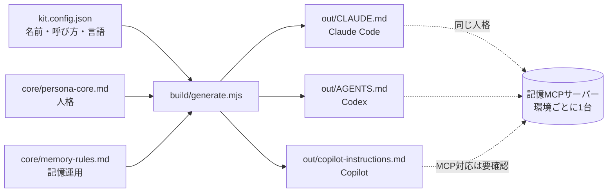

# persona-kit

**人格と記憶運用のルールを1か所で書き、Claude Code / OpenAI Codex / GitHub Copilot の3ツール向けの指示ファイルへ書き出すキット。**

私用でうまく回っている「同一人格 + 記憶サーバー」の仕組みを、別環境(社用など)へ持ち込むための雛形。人格の中身は穴埋めテンプレートに一般化してあり、個人情報は含まない。

---

## 構成

```
persona-kit/
├─ kit.config.json          名前・呼び方・言語などの設定(これを編集する)
├─ core/
│  ├─ persona-core.md       人格の共通ソース(文体・事実性・自走の境界)
│  └─ memory-rules.md       記憶運用の共通ソース(器の使い分け・週次点検)
├─ build/generate.mjs       生成スクリプト(Node 18+・依存ゼロ)
├─ out/                     生成物(git管理外)
│  ├─ CLAUDE.md
│  ├─ AGENTS.md
│  └─ copilot-instructions.md
└─ memory-server/PORTING.md 記憶MCPサーバーを別環境へ建てるときの変更点一覧
```



## 使い方

```bash
node build/generate.mjs                      # kit.config.json → out/
node build/generate.mjs my.config.json ./dist  # 設定と出力先を指定
```

生成結果には各ツールの推奨サイズに対する残量が出る。超えると `WARN` が出るが生成は止まらない。

```
  wrote CLAUDE.md                  150 lines / 200 (ok)
  wrote AGENTS.md                  9861 bytes / 32768 (ok)
  wrote copilot-instructions.md    74 lines / 120 (ok)
```

## テンプレートの書き方

`core/*.md` は3つの記法だけ覚えればよい。

| 記法 | 意味 |
| --- | --- |
| `<!-- @section id=X targets=claude,codex,copilot -->` … `<!-- @end -->` | 列挙したツールにだけ出力する |
| 行頭 `[detail] ` | Claude/Codexには出す。Copilotでは落とす(短さが求められるため) |
| `{{NAME}}` | `kit.config.json` の同名キーで置換。埋まらない変数があると生成は**失敗する** |

セクションの外に書いたテキストは出力されない。テンプレート自身の注記はそこへ書く。

### 設定キー

| キー | 例 | 使われ方 |
| --- | --- | --- |
| `NAME` | `Example` | アシスタントの名前・一人称 |
| `USER_CALL` | `あなた` | 相手の呼びかけ |
| `LANGUAGE` / `CODE_LANGUAGE` | `日本語` / `英語` | 応答とコード内の言語 |
| `TONE` | 敬体ベースで… | 文体の一言指定 |
| `HANDOVER_CAP` | `20` | 申し送りの保持件数 |
| `REVIEW_DAY` | `毎週金曜` | 記録の点検日 |
| `MEMORY_TOOL` | `memory MCP` | 記憶サーバーの呼び名 |
| `SCOPE_LABEL` | `社用` | このプロファイルの適用範囲 |
| `DATE_EXAMPLE` | `2026-08-31` | 絶対日付の書式例 |

## データ分離の原則

**この3つは例外なし。**

1. **私用の記憶と社用の記憶を相互接続しない。** 記憶MCPサーバーは環境ごとに別インスタンスを建て、片方のクライアントに両方を登録しない。
2. **記憶データのリポジトリ/ストレージは非公開に保つ。** 生成した指示ファイルには個人情報を入れない(このキットのテンプレートは一般化済み)。
3. **MCPサーバーや外部AIツールを社用環境へ入れる前に、会社のポリシーを確認する。** 外部サービス利用・データ持ち出し・ソースコードの送信可否は組織ごとに違う。ポリシーがキットの指示と矛盾したら、ポリシーが常に優先する。

## 社用に建てる手順(5歩)

1. `kit.config.json` をコピーして名前・呼び方・`SCOPE_LABEL` を社用の値に書き換える。
2. `node build/generate.mjs` で3形式を生成する。
3. 各ツールの置き場所へ配る。
   - Claude Code: `~/.claude/CLAUDE.md`(個人) または リポジトリの `./CLAUDE.md`(共有)
   - Codex: `~/.codex/AGENTS.md`(個人) または リポジトリルートの `AGENTS.md`
   - Copilot: `.github/copilot-instructions.md`
4. 記憶サーバーが要るなら `memory-server/PORTING.md` に沿って社用インスタンスを1台建てる(会社ポリシーの確認が先)。
5. 1週間使い、効かなかったルールを `core/*.md` へ反映して再生成する。**out/ を直接編集しない。**

---

## 各ツールの対応状況

以下はすべて **2026-08-31 に一次情報を取得**して確認した。確認できなかったものは「未確認」と明記する。

| 項目 | Claude Code | OpenAI Codex | GitHub Copilot |
| --- | --- | --- | --- |
| 個人設定ファイル | `~/.claude/CLAUDE.md` | `~/.codex/AGENTS.md` | 個人指示(GitHub上で設定) |
| リポジトリ設定 | `./CLAUDE.md` / `./.claude/CLAUDE.md` | ルート〜作業ディレクトリの各 `AGENTS.md` | `.github/copilot-instructions.md` |
| パス別ルール | `.claude/rules/*.md` | サブディレクトリの `AGENTS.md` | `.github/instructions/*.instructions.md`(`applyTo` グロブ必須) |
| 組織配布 | managed settings(下記) | 未確認 | 組織レベル指示(organization owner のみ) |
| 優先順位 | managed → user → project → local | 連結。作業ディレクトリに近いほど後=優先 | 個人 > リポジトリ > 組織 |
| サイズの目安 | **1ファイル200行未満**(推奨)/ 4MiB超は読み飛ばし | **合計32KiB**(`project_doc_max_bytes` 既定) | **2ページ以内**・タスク固有にしない |
| 他形式の読み込み | AGENTS.md は非対応。`@AGENTS.md` でimportする | — | `AGENTS.md` / `CLAUDE.md` / `GEMINI.md` を代替として読む |
| MCP対応 | 対応 | 対応 | **下記参照(制約あり)** |

### Copilot の MCP 対応(重要)

- Copilot cloud agent と Copilot code review の MCP は **2026-07-29 にGA**(Pro/Pro+/Business/Enterprise)。ただしこのGA日とプラン一覧は検索結果由来で、changelogページ自体は未取得(**準確認**)。
- 設定場所: リポジトリの **Settings → Copilot → MCP servers**(JSON)。認証トークンは **Settings → Secrets and variables → Agents**。
- **制約(これが効く)**: MCPの **tools のみ**対応。resources と prompts は使えない。**OAuthを使うリモートMCPサーバーは非対応。** 既定では書き込み系ツールなし。
- つまり、私用の記憶サーバー(GitHub OAuth方式)は**そのままではCopilotから使えない**。Copilotから使うなら、PATやAPIキーによるヘッダー認証の経路を用意する必要がある。
- VS Code側(クライアント)の `mcp.json` の具体的なパスは**未確認**(検索要約のみで一次情報を取得できていない)。

### 出典(2026-08-31取得)

| 内容 | URL |
| --- | --- |
| Claude Code メモリ/CLAUDE.md/import/200行の目安 | https://code.claude.com/docs/en/memory |
| Claude Code managed settings・配布方法 | https://code.claude.com/docs/en/managed-settings |
| Claude Code settings優先順位 | https://code.claude.com/docs/en/settings |
| Codex AGENTS.md の探索順・連結・上書き | https://learn.chatgpt.com/docs/agent-configuration/agents-md |
| Codex `project_doc_max_bytes` 等 | https://learn.chatgpt.com/docs/config-file/config-advanced |
| agents.md 標準(横断仕様) | https://agents.md |
| Copilot カスタム指示・`applyTo`・2ページ目安・優先順位 | https://docs.github.com/en/copilot/customizing-copilot/adding-custom-instructions-for-github-copilot |
| Copilot 組織レベル指示 | https://docs.github.com/en/copilot/how-tos/configure-custom-instructions/add-organization-instructions |
| Copilot coding agent の MCP と制約 | https://docs.github.com/en/copilot/concepts/agents/coding-agent/mcp-and-coding-agent |

### 確認できなかったこと

- Codex の `experimental_instructions_file` は現行ドキュメントに見当たらなかった。`model_instructions_file`(組み込みシステム指示を**丸ごと置き換える**キー)が該当する可能性がある。
- Codex の組織レベル配布の仕組み。
- `project_doc_max_bytes` の既定値を 64KiB とする二次情報があったが、公式ページは 32KiB と記載。**32KiB を採用**。
- VS Code の MCP 設定ファイルの正確なパス。
- Copilot MCP のGA日とプラン範囲(changelogページ未取得)。

**注**: Claude Code の `CLAUDE.local.md` は廃止されていない。現行ドキュメントに個人用の仕組みとして記載がある。
