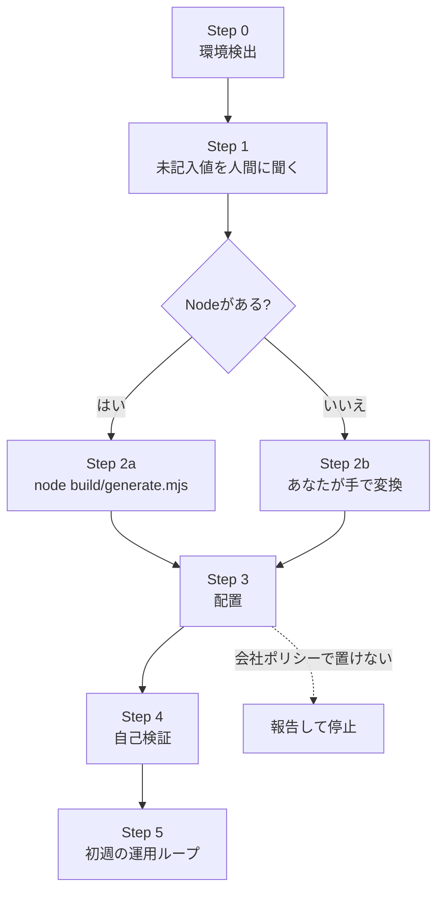

# SETUP-FOR-AI — 導入手順(読み手はAIエージェント)

**このファイルを読んでいるあなた(AIエージェント)が、このキットを今いる環境へ導入します。**

人間がやるのは1つだけ、**`kit.config.json` の未記入値を教えること**です。それ以外の判断・実行はあなたが行い、終わったら事後報告してください。

## 全体フロー



## 原則(全Stepに効く)

- **勝手に上書きしない。** 既存ファイルがあれば必ずバックアップか追記を選ぶ(Step 3の規則)。
- **推測で埋めない。** 分からない設定値は聞く。聞けないなら止めて報告する。
- **会社ポリシーが最優先。** 迷ったら止めて人間に判断を仰ぐ。
- **各Stepの最後に、次へ進めるか自分で確認する。**確認できないまま次へ行かない。

---

## Step 0: 環境検出

**目的**: 自分が何者で、どのツールが使えるかを確定する。人間には聞かない。

### 0-1. 自分がどのツールか

自分のシステムプロンプト・実行環境から判定してください。判定できないときは、次のファイルの有無が手がかりになります。

| 手がかり | 判定 |
| --- | --- |
| `~/.claude/` が存在 / `CLAUDE.md` を読み込んでいる | **Claude Code** |
| `~/.codex/config.toml` が存在 / `AGENTS.md` を読み込んでいる | **OpenAI Codex** |
| `.github/copilot-instructions.md` を読み込んでいる | **GitHub Copilot** |

3つとも該当しない場合は、**Claude Code向けの出力を作って人間に渡す**のが無難です。その旨を報告してください。

### 0-2. OSと道具の確認

```bash
# OS
uname -s 2>/dev/null || echo "Windows (uname なし)"

# Node(Step 2の分岐に使う)
node --version 2>/dev/null || echo "NODE_NOT_FOUND"

# git(Step 5で使う。無くても導入自体はできる)
git --version 2>/dev/null || echo "GIT_NOT_FOUND"

# 自分がキットのどこにいるか
ls kit.config.json core/ build/generate.mjs
```

Windows の PowerShell しか使えない場合:

```powershell
$PSVersionTable.OS
node --version
git --version
Get-ChildItem kit.config.json, core, build/generate.mjs
```

### 失敗したときの分岐

| 症状 | 対応 |
| --- | --- |
| `kit.config.json` が見つからない | キットのルートにいない。`find . -name kit.config.json` で探して移動する |
| Node も PowerShell も使えない(コマンド実行不可) | **Step 2b(手作業変換)へ進む。**ファイル読み書きだけで完遂できる |
| 自分がどのツールか判定できない | Claude Code向けを作り、その判断を報告に明記する |

---

## Step 1: 人間に聞く(これだけ)

**聞くのは `kit.config.json` の `<<記入:` が残っている値だけです。それ以外は聞かずに進めてください。**

### 1-1. 未記入値を機械的に検出する

```bash
grep -n '<<記入' kit.config.json
```

Node があるなら、生成を1回走らせるだけで一覧が出ます(未記入があるとエラーで停止し、キーを列挙します)。

```bash
node build/generate.mjs
```

### 1-2. 聞き方

**1回のやり取りでまとめて聞いてください。**1つずつ往復しない。各項目に「なぜ要るか」を1行添えます。

```
導入のために、以下だけ教えてください。それ以外は既定値で進めます。

1. NAME — 私の名前(一人称にもなります)。例: Stob
2. USER_CALL — あなたの呼び方(例: 名字+さん / あなた / ニックネーム)
3. SCOPE_LABEL — このプロファイルの適用範囲。例: 社用
4. MODEL_DEFAULT / MODEL_JUDGE / MODEL_WORK — 既定モデルと、上位判断・実作業に使うモデル
5. RESOURCE_RULES — 読み書きしてよい場所/いけない場所(重要。ここが空だと境界が守れません)
6. REVIEW_DAY — 週次点検の曜日。例: 毎週金曜
7. BUSY_WINDOW — 自走を避けたい時間帯。無ければ「特になし」
8. MEMORY_TOOL — 記憶サーバーの呼び名。用意しないなら「(なし)」

分からない項目は「未定」と答えてもらえれば、後から変えられる既定値を入れます。
```

### 1-3. 受け取った値を書き込む

`kit.config.json` の該当キーの値を、受け取った文字列に置き換えます。`<<記入:` を残さないこと。

「未定」と言われた項目は、次の暫定値を入れて**その旨を報告に書いてください**。

| キー | 未定時の暫定値 |
| --- | --- |
| `MODEL_DEFAULT` / `MODEL_JUDGE` / `MODEL_WORK` | `既定のモデル` / `上位判断用の上位モデル` / `実作業用の標準モデル` |
| `RESOURCE_RULES` | `(未確定。確定するまで、作業リポジトリの外へ書き込まない)` |
| `BUSY_WINDOW` | `特になし` |
| `MEMORY_TOOL` | `(なし)` |

### 失敗したときの分岐

| 症状 | 対応 |
| --- | --- |
| 人間に聞けない(非対話実行) | **`examples/example.config.json` で生成して `out-example/` に出し、「サンプル値で作った。実運用前に記入が要る」と報告して停止。**本番の置き場所へは配置しない |
| `RESOURCE_RULES` を答えてもらえない | 上の暫定値を入れる。**境界が未確定である事実を報告の先頭に書く** |

---

## Step 2a: 生成する(Nodeがある場合)

```bash
node build/generate.mjs
```

出力は `out/` に入ります。**警告(`WARN`)が出ていないことを確認してください。**

```
  wrote CLAUDE.md                    146 lines / 200 (ok)
  wrote claude/work-style.md         69 lines / 200 (ok)
  wrote claude/memory-rules.md       72 lines / 200 (ok)
  wrote AGENTS.md                    21311 bytes / 32768 (ok)
  wrote copilot-instructions.md      112 lines / 120 (ok)
  wrote agents/ (3): docs.md, explorer.md, reviewer.md
  wrote skills/ (3): session-start, tech-watch, weekly-review
```

### 失敗したときの分岐

| 症状 | 対応 |
| --- | --- |
| `ERROR: 未記入の設定値があります` | Step 1へ戻る。列挙されたキーを埋める |
| `ERROR: unresolved placeholders in config` | そのキーが `kit.config.json` に無い。空文字ではなく文字列を入れる |
| `ERROR: duplicate @section id` | `core/*.md` を編集して同じidを2回書いている。片方を消す |
| `WARN ... OVER` が出た | そのツールの推奨サイズ超過。該当セクションの `targets=` からそのツールを外すか、行を `[detail]` にする |

---

## Step 2b: 生成する(Nodeが無い場合 — あなたが手で変換する)

**Node が使えなくても、あなたが同じ変換を手で行えば同じ成果物が作れます。** `build/generate.mjs` の仕様は次のとおりです。

### 入力

1. `core/persona-core.md` → `core/work-style.md` → `core/memory-rules.md` の**この順**で読む。
2. `kit.config.json` の値を使う。

### 変換規則

**規則1: セクションの抽出**

```
<!-- @section id=<id> targets=claude,codex,copilot -->
...本文...
<!-- @end -->
```

- マーカーの**外側にある行は出力しない**(テンプレート自身の注記なので捨てる)。
- `targets=` に**今作っているツールの名前が含まれるセクションだけ**を出力する。名前は `claude` / `codex` / `copilot`。

**規則2: `[detail]` 行**

- 行頭が `[detail] ` の行は、**claude と codex では `[detail] ` を取り除いて出力**する。
- **copilot では行ごと捨てる。**

**規則3: 変数の置換**

- `{{KEY}}` を `kit.config.json` の同名キーの値に置き換える。
- 置き換えられない `{{...}}` が1つでも残ってはいけない。残ったら止めて報告する。

**規則4: 空行の整理**

- 3行以上連続した空行は2行に詰める。先頭と末尾の空行は削る。

### 出力するファイル

| ファイル | 中身 | サイズの目安 |
| --- | --- | --- |
| `out/CLAUDE.md` | 見出し + `persona-core.md` のセクション(claude向け) + 末尾に `@claude/work-style.md` と `@claude/memory-rules.md` の2行 | **200行未満** |
| `out/claude/work-style.md` | `work-style.md` のセクション(claude向け) | 200行未満 |
| `out/claude/memory-rules.md` | `memory-rules.md` のセクション(claude向け) | 200行未満 |
| `out/AGENTS.md` | 3ファイル全部を連結(codex向け) | **32KiB未満** |
| `out/copilot-instructions.md` | 3ファイル全部を連結(copilot向け・`[detail]`なし) | **120行未満** |
| `out/agents/*.md` | `agents/*.md` を変数置換だけしてコピー | — |
| `out/skills/<name>/SKILL.md` | `skills/**` を変数置換だけしてコピー | — |

**自分が使うツールの分だけ作れば十分です。**3つ全部は要りません。

### 失敗したときの分岐

| 症状 | 対応 |
| --- | --- |
| サイズの目安を超えた | copilot なら `targets` から外すセクションを増やす。claude なら分冊を1つ増やして `@` import を足す |
| 変換が正しいか不安 | Step 4 の検証(未置換 `{{}}` が無いこと)で確かめられる |

---

## Step 3: 配置する

**配置の前に、会社ポリシーで「AIツールの設定ファイルを置いてよいか」を確認してください。**確認できないなら置かずに報告して止まります。

### 3-1. ツール別・OS別の置き場所

**Claude Code**

| 範囲 | パス |
| --- | --- |
| 個人(全プロジェクト) | `~/.claude/CLAUDE.md` + `~/.claude/claude/*.md` |
| リポジトリ共有 | `./CLAUDE.md` + `./claude/*.md` |
| サブエージェント | `~/.claude/agents/*.md` または `.claude/agents/*.md` |
| skill | `~/.claude/skills/<name>/SKILL.md` または `.claude/skills/<name>/SKILL.md` |

```bash
mkdir -p ~/.claude/claude ~/.claude/agents ~/.claude/skills
cp out/claude/*.md ~/.claude/claude/
cp out/agents/*.md ~/.claude/agents/
cp -r out/skills/* ~/.claude/skills/
cp out/CLAUDE.md ~/.claude/CLAUDE.md      # 3-2の判断規則を先に読むこと
```

```powershell
# Windows PowerShell
New-Item -ItemType Directory -Force "$HOME\.claude\claude", "$HOME\.claude\agents", "$HOME\.claude\skills"
Copy-Item out\claude\*.md "$HOME\.claude\claude\"
Copy-Item out\agents\*.md "$HOME\.claude\agents\"
Copy-Item out\skills\* "$HOME\.claude\skills\" -Recurse -Force
```

**OpenAI Codex**

| 範囲 | パス |
| --- | --- |
| 個人 | `~/.codex/AGENTS.md` |
| リポジトリ | ルートの `./AGENTS.md` |
| サブエージェント | `~/.codex/agents/*.toml`(**形式変換が要る**) |
| skill | `~/.agents/skills/<name>/SKILL.md`(**`.claude/skills/` は読まれない**) |

サブエージェントは Markdown から TOML へ変換します。本文を `developer_instructions` に入れ、`name` / `description` / `model` はそのまま移します。

**GitHub Copilot**

| 範囲 | パス |
| --- | --- |
| リポジトリ全体 | `.github/copilot-instructions.md` |
| カスタムエージェント | `.github/agents/<name>.agent.md`(frontmatterに `target` を追加) |
| skill | `.github/skills/<name>/SKILL.md`(`.claude/skills/` や `.agents/skills/` も読まれる) |

**Copilot 出力は要約版です。**完全な振る舞いが要るなら、リポジトリルートに `out/AGENTS.md` を置いてください(Copilot は `AGENTS.md` も読みます)。

### 3-2. 既存ファイルがあるときの判断規則

**上書きは最後の手段です。**次の順で判断してください。

| 状況 | 対応 |
| --- | --- |
| 置き場所に**ファイルが無い** | そのままコピーする |
| 既存ファイルがあり、**先頭に `Generated by persona-kit` のコメントがある** | このキットが前回作ったもの。**上書きしてよい** |
| 既存ファイルがあり、**中身が他人/他ツールの指示** | **上書きしない。**`<file>.bak.<日付>` にバックアップを取り、既存の末尾に**追記**する。追記した旨を報告する |
| 既存ファイルがあり、**中身が空か空白のみ** | 上書きしてよい |
| 判断がつかない | **触らず、`out/` に置いたままにして人間に報告する** |

追記するときは、境目が分かるようにしてください。

```markdown

<!-- ここから persona-kit (YYYY-MM-DD 追記) -->
...生成した内容...
<!-- ここまで persona-kit -->
```

バックアップの取り方:

```bash
cp ~/.claude/CLAUDE.md ~/.claude/CLAUDE.md.bak.$(date +%Y%m%d)
```

### 失敗したときの分岐

| 症状 | 対応 |
| --- | --- |
| **会社ポリシーで置けない/確認できない** | **配置せず停止。**`out/` の場所と、何を置こうとしたかを人間に報告する |
| 書き込み権限が無い | 個人スコープ(`~/`)ではなくリポジトリスコープ(`./`)を試す。両方だめなら報告して停止 |
| 組織配布の設定が既にある | **上書きしない。**組織設定が優先されるので、個人スコープに置くか、管理者に相談するよう報告する |

---

## Step 4: 自己検証

**置いただけでは終わりません。効いているかを確かめます。**

### 4-1. 中身の検証(すぐできる)

```bash
# 未置換の変数が残っていないか(何も出なければOK)
grep -rn '{{' out/

# 未記入プレースホルダが残っていないか(何も出なければOK)
grep -rn '<<記入' out/ kit.config.json

# 配置先にファイルが存在するか
ls -la ~/.claude/CLAUDE.md ~/.claude/claude/ 2>/dev/null
```

### 4-2. 情報漏れの検証

**このキットは個人情報を含まない前提です。**設定に個人情報を書き込んでいないか確認します。

```bash
# 氏名・メールアドレス・社内の固有名が混ざっていないか目視で確認する
grep -rniE '@[a-z0-9.-]+\.(com|jp|net)|[0-9]{3}-[0-9]{4}' out/ kit.config.json
```

ヒットしたら、それが本当に必要かを検討し、**個人情報なら `kit.config.json` から外して記憶サーバー側へ移してください。**

### 4-3. 読み込まれているかの検証(いちばん確実)

**新しいセッションを開始して、次を確認します。**

| 確認項目 | 期待される結果 |
| --- | --- |
| 名乗り | `NAME` に設定した名前で自称する |
| 呼びかけ | `USER_CALL` の呼び方をする |
| 文体 | 結論が先頭にあり、見出し・箇条書きで構造化されている |
| 「今の設定を教えて」と聞く | アクセス境界や週次点検の日を答えられる |

Claude Code なら、次でも確認できます。

```bash
claude --version
# セッション内で /status を実行し、CLAUDE.md が読み込まれているか確認する
```

### 失敗したときの分岐

| 症状 | 原因と対応 |
| --- | --- |
| 名乗りが変わらない | ①配置パスが違う ②新セッションを開いていない ③組織配布の設定に上書きされている。この順で確認する |
| `{{...}}` が出力に残っている | Step 2 をやり直す。手作業変換なら規則3の見落とし |
| 一部のルールだけ効かない | そのセクションの `targets=` に自分のツールが入っているか確認する。Copilot は要約版なので**元から落ちているセクションがある**(`COVERAGE.md` 参照) |
| 応答が長すぎる/短すぎる | `TONE` を調整して再生成する |

---

## Step 5: 初週の運用

**導入して終わりではありません。1週間かけて合わせ込みます。**

### 5-1. 効かなかったルールを直すループ

```
気づく → core/*.md を直す → 再生成 → 配置 → 次のセッションで確認
```

- **`out/` を直接編集しないでください。**次の生成で消えます。直すのは必ず `core/*.md` か `kit.config.json`。
- 直したら理由をコミットメッセージに残します(git がある場合)。

```bash
git add -A && git commit -m "persona-kit: <直した内容>(<なぜ直したか>)"
```

### 5-2. 週次点検

`REVIEW_DAY` に `skills/weekly-review/` の手順を実行してください。見るのは4つです。

1. 記録(ノート)の冒頭に現況・次の一手があるか。
2. 一度も使われなかった skill / サブエージェントは無いか。あれば削除を提案する。
3. 設定や外部サービスの事実が古くなっていないか。
4. 一時メモに、恒久ルールへ昇格すべき知見が埋もれていないか。

### 5-3. 道具を増やす

同じ手順を2回繰り返したら、**3回目を待たずに skill を作ってください**(`自己拡張` セクション)。作ったものは `skills/` に足して再生成し、コミットメッセージに目的を残します。

---

## 完了報告のテンプレート

導入が終わったら、次の形で報告してください。

```
persona-kit の導入が完了しました。

【結論】<何が使える状態になったか。残っている作業があれば1文で>

【設定】
- 記入してもらった値: <キー名の一覧>
- 暫定値で埋めた値: <あれば。無ければ「なし」>

【配置したもの】
- <パス> (新規 / 上書き / 追記+バックアップ)

【検証】
- 未置換の変数: 0件
- 新セッションでの名乗り: <確認できた / 未確認>
- <確かめていないものは「未検証」と明記する>

【次の一手】
- <あなたが続けること / 人間の判断が要ること>
```

---

## 途中で止まるべきケース(まとめ)

次に当たったら、**進めずに人間へ報告して止まってください。**

1. 会社ポリシーで、AIツールの設定ファイルを置いてよいか確認できない。
2. 既存の指示ファイルがあり、上書きしてよいか判断がつかない。
3. 組織配布(managed settings)の設定が既に存在する。
4. `RESOURCE_RULES` が確定しないまま、リポジトリ外への書き込みが必要になった。
5. 記憶サーバーを建てる話になった(`memory-server/PORTING.md` の作業は、会社ポリシー確認が先)。
6. 非対話実行で、未記入値を聞く相手がいない。

止まるときは「何をして、どこで止まり、次に何が要るか」を書いてください。黙って止まらないこと。
